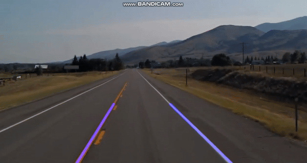

# Lane-Detection-Using-OpenCV
## Steps
- Capturing and decoding video file
- Grayscale conversion of image
- Reduce noise
- Detect edges by canny
- Region of Interest 
- Hough Line Transform
## Input

## Output Screenshot of the video

